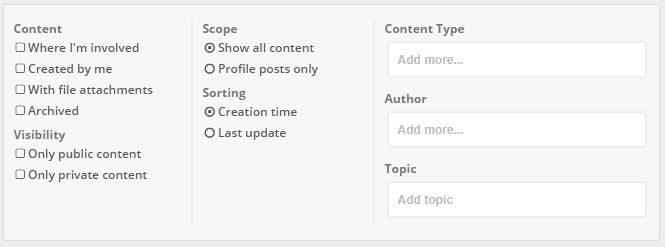

## Released July 2020

### Nested comments

Prior to HumHub 1.6 users were not able to directly reply to another users comments. That sometimes led to cluttered
conversations. With this update we have implemented support for nested comments, adding more structure and clarity to longer conversations. Users are now able to directly reply to other users comments. This release will be adding one additional level of comments. That may change with future releases.

### Stream enhancements

HumHub 1.6 introduced multiple stream and stream filter enhancements.



#### New profile stream filter

Since HumHub 1.5 all content a user creates, even outside of the profile, can be displayed on the profile stream. This is a great way to get an overview of a users activity.

The only way of disabling this feature was with a [configuration file](../../admin/advanced-configuration.md). 
HumHub 1.6 will introduce an additional filter to the profile stream to enable or disable this behavior on demand.
Users can activate or deactivate this filter by choice.

You can manage the default state of this filter by adding the following [configuration](../../admin/advanced-configuration.md):

```php
return [
    'modules' => [
        'user' => [
            'includeAllUserContentsOnProfile' => false
        ]
    ]
];
```

#### Archived stream filter

In older versions of HumHub the "Include archived content" filter could be used to include archived content
but there was no way of explicitly filtering for archived content. In HumHub 1.6 this filter was renamed to 
"Archived" and now will only include archived content when activated.

#### User profile archive

Users now can archive content from their profile.

#### Disable profile stream

In order to cover even more use-cases with the software, the profile stream 
can now be disabled by the following [file configuration](../../admin/advanced-configuration.md):

```php
return [
    'modules' => [
        'user' => [
            'profileDisableStream' => true
        ]
    ]
];
```

#### Maximum amount of pinned content entries

Prior to HumHub 1.6 users could pin up to two posts within a profile or a space. This limit could not be configured
and was set due to stream limitations of older HumHub versions. In HumHub 1.6 this value can be configured for profiles
and spaces independently.

**New default values**:

| Configuration        | Default           |
| ------------- |:-------------|
| maxPinnedSpaceContent      | 10 |
| maxPinnedProfileContent      | 2 |

**Overwrite default values in [file configuration](../../admin/advanced-configuration.md)**:

```php
return [
    'modules' => [
        'content' => [
            'maxPinnedSpaceContent' => 5,
            'maxPinnedProfileContent' => 1,
        ]
    ]
];
```

#### Additional user profile fields

HumHub 1.6 adds the concept of virtual profile fields. Virtual profile fields can be used to add values
which are not editable and which are not part of the profile table.
 
HumHub 1.6 by default supports the following virtual profile fields:

- User email
- Username

Those fields will be created by default when installing HumHub. In case of an existing installation, those two fields
can be added manually under `Administration -> Users -> Profiles`.

### Topic chooser visibility

In older HumHub versions a topic chooser input was visible for users even if there were no topics available on a space
and the user did not have the permission to add topics. This led to confusion for users not familiar with the topic concept. 
Now the topic chooser is only visible to users which are either able to select existing or create new topics. 

### For developers

#### Stream filter enhancements

HumHub 1.6 simplifies the definition of stream filters. You can now add or remove stream query filters within your 
`StreamAction:initQuery` as follows:

 ```php
class MyStreamAction extends ContentContainerStream
{
    protected function initQuery($options = [])
    {
        $query = parent::initQuery($options);
        $query->addFilterHandler(new MyStreamFilter());
        return $query;
    }
}
```

The same can be achieved by implementing a custom `StreamQuery` as for example:

 ```php
class MyStreamAction extends ContentContainerStream
{
    public $streamQuery = MyStreamQuery::class;
}
```

 ```php
class MyStreamQuery extends ContentContainerStreamQuery
{
    protected function beforeApplyFilters()
    {
        $this->addFilterHandler(MyStreamFilter::class);
        parent::beforeApplyFilters();
    }
}
```

#### Enhanced testing

We have simplified the configuration of the test environment by adding a `@protected/humhub/tests/config/env/env.php`
file which now should be used to configure e.g. the database access of your test environment instead of overwriting
`@protected/humhub/tests/config/common.php`.

Furthermore we've updated the [codeception version to v4.1.6](https://codeception.com/changelog). Codeception 4 brings
many new tools should ease the development of core and module tests.

#### New form field widgets

There are two new form field widgets available:

 - `humhub\modules\ui\form\widget\SortOrderField`: Sort order management
 - `humhub\modules\ui\form\widget\ContentVisibilitySelect`: Content visibility selection

