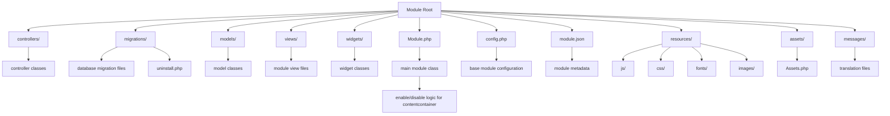

Module Structure
================

Basically HumHub modules are identical to [Yii2 modules](http://www.yiiframework.com/doc-2.0/guide-structure-modules.html).

A very basic module consists of the following elements:



## Main Configuration File `config.php`

The `config.php` file enables automatic module loading and event configuration, without the need to manually modify the main application config. 
Module configuration files of enabled modules are processed by the `humhub\components\bootstrap\ModuleAutoLoader` within the `bootstrap` process of the application.

The `config.php` should contain the following attributes:

- **id** - Unqiue ID of the module (required)
- **class** - Namespaced classname of the module class (required)
- **namespace** - The namespace of your module (required)
- **events** - Array containing the modules event configuration (optional)
- **urlManagerRules** - Array of [URL Manager Rules](http://www.yiiframework.com/doc-2.0/yii-web-urlmanager.html#addRules()-detail) (optional)
- **modules** - Submodules (optional)

Example:

```php
<?php

use johndoe\example\Module;
use humhub\widgets\TopMenu;

return [
    'id' => 'example',
    'class' => 'johndoe\example\Module',
    'namespace' => 'johndoe\example',
    'events' => [
        ['class' => TopMenu::class, 'event' => TopMenu::EVENT_INIT, 'callback' => ['johndoe\example\Events', 'onTopMenuInit'`,
    ]
];
?>
```

> Note: Do not execute any code in the `config.php` since the result will be cached!

## Base class `Module.php`

See chapter [Base Class](modules-base-class.md) for an introduction of module base classes.

## Meta data `module.json`

The `module.json` file holds basic meta data which is used for example by the marketplace.

Available attributes:

- **id** - The module ID
- **version** - The module version. This must follow the format of X.Y.Z. (Required)
- **name** - The modules name
- **description** - A short module description
- **humhub** - HumHub requirements
    - **minVersion** - The minimum HumHub core version this module is compatible with.
    - **maxVersion** - The maximum HumHub core version this module is compatible with.
- **keywords** - (Array) Some keywords 
- **screenshots** - (Array) Some screenshots for the marketplace, those should reside in the `resourcesPath` of your module.
- **homepage** - An URL to the website of the module. (Optional)
- **authors** - (Array) The authors of the module. (Optional)
	- **name** - The author's name.
	- **email** - The author's email address.
	- **homepage** - An URL to the author's website.
	- **role** -  The author's role (e.g. developer or translator)


Example `module.json` file:

```json
{
    "id": "example",
    "version": "1.0",
    "name": "My Example Module",
    "description": "My testing module.",
    "humhub": {
        "minVersion": "1.2",
		"maxVersion": "2.0"
    },
    "keywords": ["my", "cool", "module"],
    "screenshots": ["assets/screen_1.jpg"],
	"homepage": "https://www.example.com",
    "authors": [
        {
            "name": "Tom Coder",
            "email": "tc@example.com",
            "role": "Developer"
        },
        {
            "name": "Sarah Mustermann",
            "email": "sm@example.com",
            "homepage": "http://example.com",
            "role": "Translator"
        }
    ]	
}
```

> Warning: You should align the `minVersion` of your module when using new features and test your modules on all supported versions.

## Documentation

The documentation files of the module must be located in the folder 'docs'.

The following table shows the default files.

| File | Required | Description |
| --- | --- | --- |
| README.md | Yes | A description and overview of the features |
| MANUAL.md | No | Information on how to use this module |
| CHANGELOG.md | Yes | A file which contains a curated, chronologically ordered list of changes for each version |
| LICENCE.md | No | Licencing information including the licence |
| DEVELOPER.md | No | Additional information for developers |


## Extended structure example

The following structure contains some additional directories and files, which can be added for specific use-cases or features. 

```mermaid
graph TD
    A[Module Root] --> B[activities/]
    A --> C[assets/]
    A --> D[components/]
    A --> Z[services/]
    A --> E[controllers/]
    A --> F[live/]
    A --> G[jobs/]
    A --> H[messages/]
    A --> I[migrations/]
    A --> J[helpers/]
    A --> K[models/]
    A --> L[modules/]
    A --> M[notifications/]
    A --> N[permissions/]
    A --> O[resources/]
    A --> P[tests/]
    A --> Q[views/]
    A --> R[widgets/]
    A --> S[Events.php]
    A --> T[Module.php]
    A --> U[config.php]
    A --> V[module.json]
    A --> W[console/]
    A --> X[interfaces/]
    A --> Y[stream/]
    
    B --> B1[activity classes]
    C --> C1[asset bundle classes]
    D --> D1[component classes]
    Z --> Z1[service classes]
    E --> E1[controller classes]
    F --> F1[live event classes]
    G --> G1[queue job classes]
    H --> H1[module message files]
    I --> I1[database migration files]
    J --> J1[utility classes]
    J1 --> J2[e.g. for URL generation]
    K --> K1[model classes]
    L --> L1[submodules]
    M --> M1[notification classes]
    N --> N1[permission classes]
    O --> O1[web assets]
    O1 --> O2[javascript files]
    O1 --> O3[stylesheets]
    O1 --> O4[images/]
    O1 --> O5[fonts/]
    P --> P1[module tests]
    Q --> Q1[view files]
    R --> R1[widget classes]
    S --> S1[static event handlers]
    T --> T1[main module class]
    U --> U1[base module configuration]
    V --> V1[module metadata]
    W --> W1[console commands]
    X --> X1[interface definitions]
    Y --> Y1[stream action classes]
```



> Info: You may want to use the [devtools Module](https://github.com/humhub/humhub-modules-devtools) to create a module skeleton.
