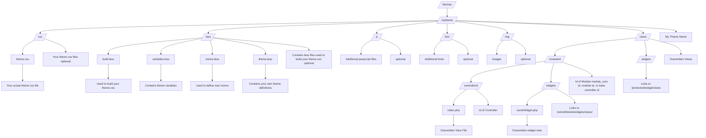

## Overview

Here are a few important tidbits:
- All themes have their files located in the /themes root or module folder.
- Each theme has its own sub-folder, in the main themes folder.
- Each theme is made of template files, image files, one or more LESS/CSS files, and sometimes even JavaScript files (.js).

## Create Own Theme Folder

> Note: Do not edit the default HumHub themes directly. All changes may overwritten on updates.

The best way to start is to copy the default theme folder `HumHub`.

Select a preferably unqiue theme name (e.g. MyCompanyName) for your new theme folder.

** Example: Copy theme folder (Linux)**

```
cd /path/to/HumHub
cp -rfa themes/HumHub themes/MyCompany
```

** Enable the theme **

Once you created an own theme folder, you need to enable it in the administration section of HumHub: 
`Administration -> Settings -> Appeareance` 


## Folder Structure Example

This overview shows a complete theme folder structure including own less and view files.


